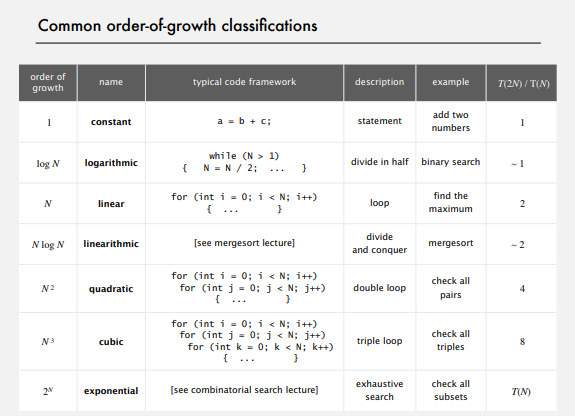

# My process
- Lec1: Introduction to Java (done)
  + IntroJava
- Lec2: Union-Find (done)
  + Percolation
  + Quick find (optimize find is O(1)) is too slow (with access model is N^2 to 
process a sequence of N union operations of N object). Union too expensive. Trees are flat,
but too expensive to keep them flat
  + Quick union: Trees can get tall. Find/connected too expensive (could be N array accesses).
  + Improvement 1: Weighting: Keep track of size of each tree to avoid tall tree by linking
root of smaller tree to root of larger tree.
    + Find: take time proportional to depth of p
    + Union: takes constant time, **given roots**
    + Depth of any node x is at most lg(N) (Pf: What cause depth of tree contain x increase? 
    The size of tree can double at most lgN time means at most lgN of depth. Why?).
    + Hence, we can ensure find O(lgN), union O(lgN), connected O(lgN)
  + Improvement 2: path compression: Make every node in path point to its grandparent
    + Keep tree almost completely flat
  + wighted QU + path compression: in theory is not linear but linear in practice
  
- Lec3: Algorithm analyzing (done)
  + Linkedlist: Hackerrank
  + Interface and Generic: Build my Linkedlist
- Lec4: Stack and Queue (done)
  + Iterator: Build my Stack and Queue
  + Stack and Queue: Hackkerank
- Lec5: Simple Sorting algorithms (done)
  + Insertion sort and Selection sort: Report in [this file](src/Lec5/Report.md)
  + Shuffle algorithm
  + Exercise on HackerRank
- Lec6: Merge sort and Quick sort (done)
  + Sort2: Ex1, Ex2
  + Mergesort and Quicksort Implementation
  + Update report in [this file](src/Lec5/Report.md)
- Lec7: Priority queue (done)
  + Priority Queue Implementation
  + Sort2: all rest exercise in Sort2
- Lec8: Midterm exam: Prepare for test (Works on Leetcode):
  + Union - Find
- Lec9: Symbol table and BinaryTree
- Lec10: BinarySearchTree, BalancedSearchTree
- Lec11: Hash Table
- Lec12: Graph
- Lec13: Minium spanning tree
- Lec14: Shortest Path
- Lec15: Dynamic Programming, NP-Completeness
